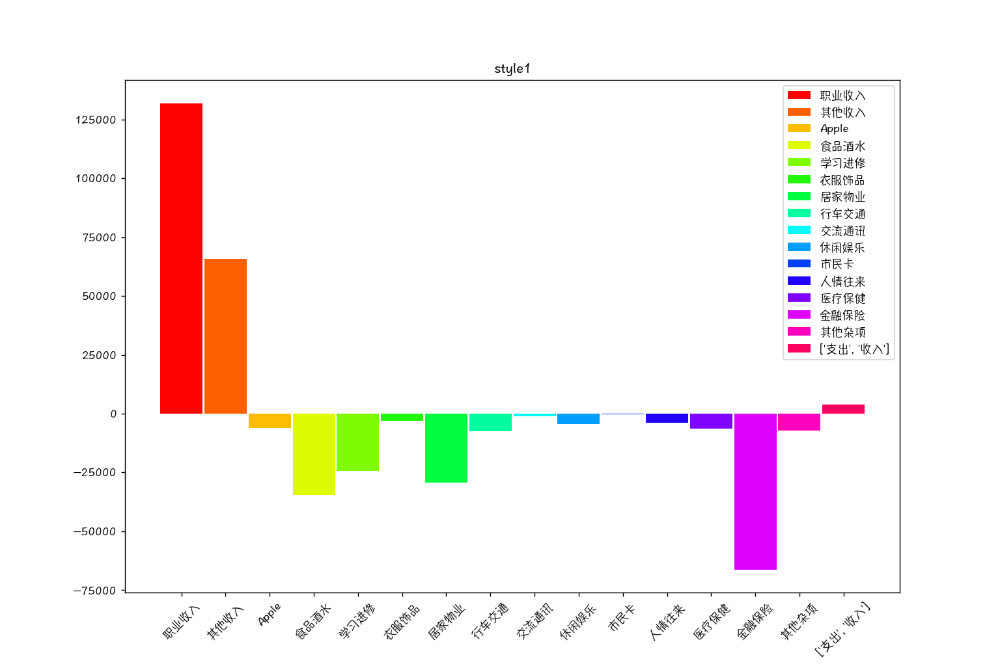
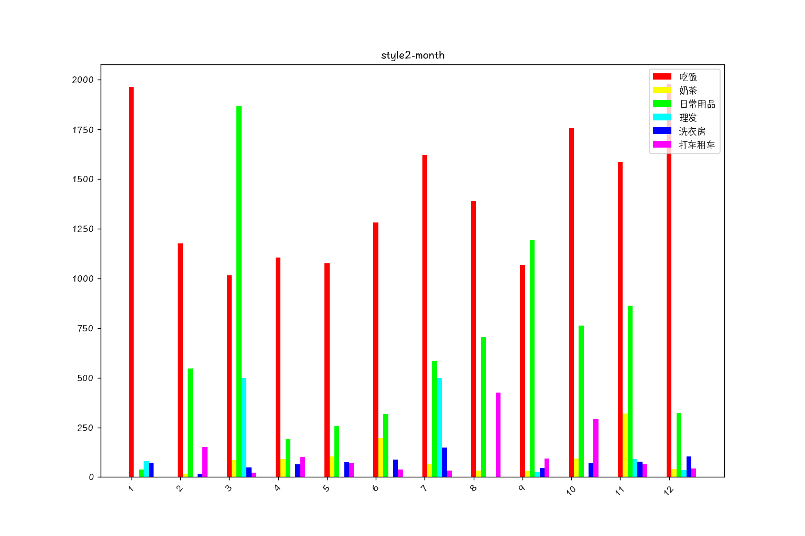
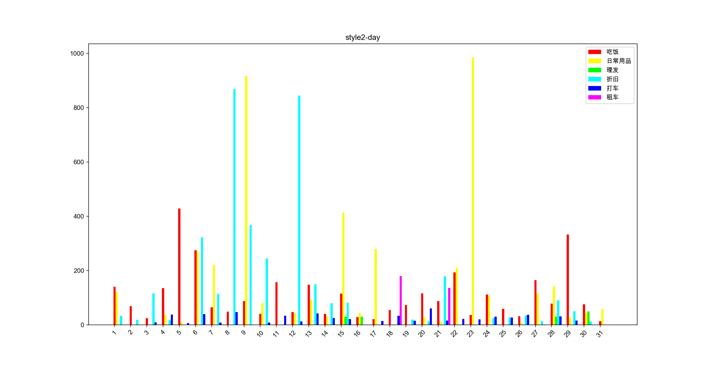
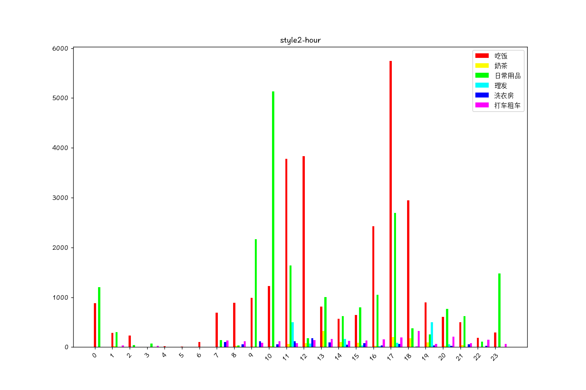
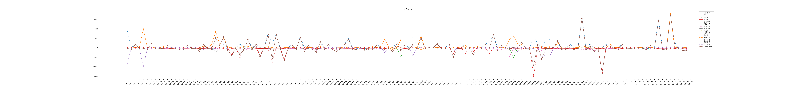
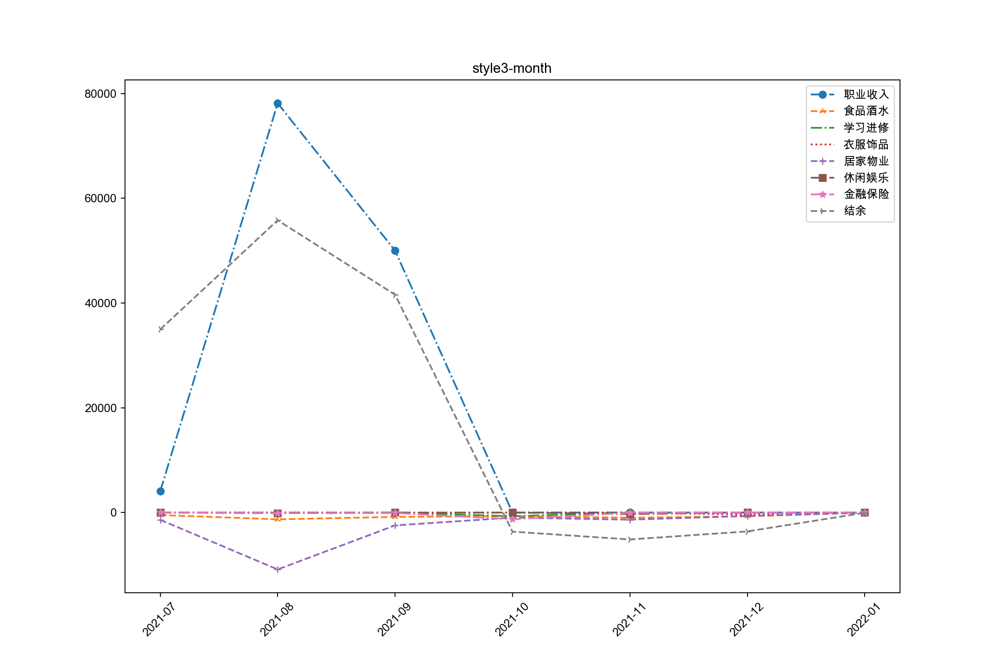
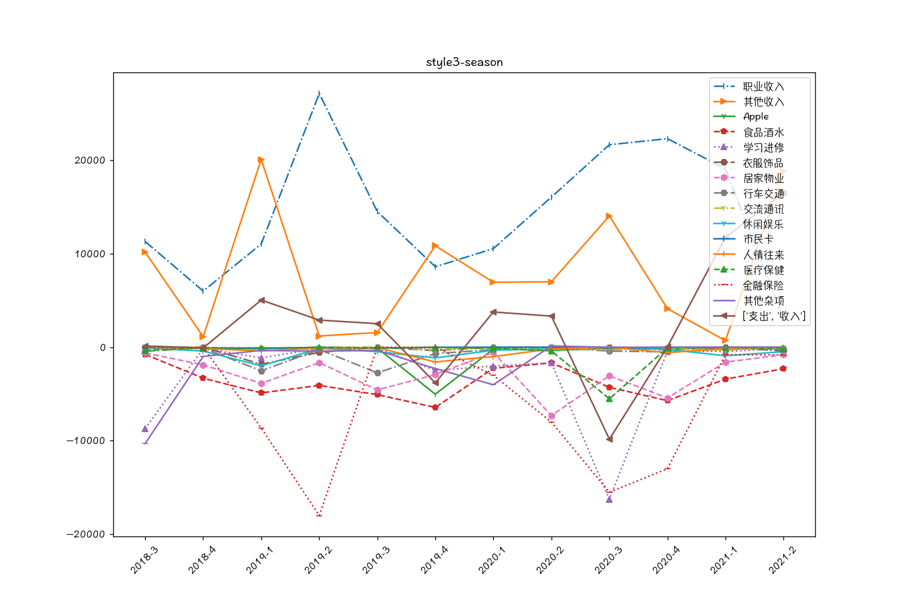
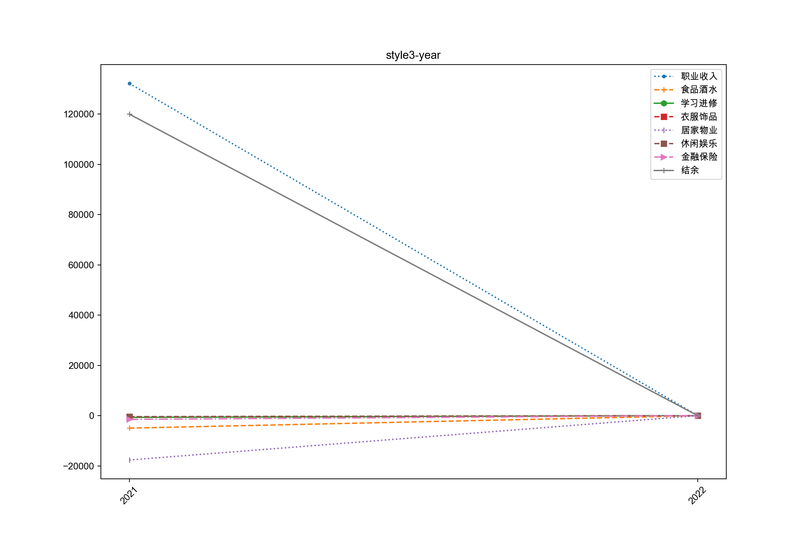
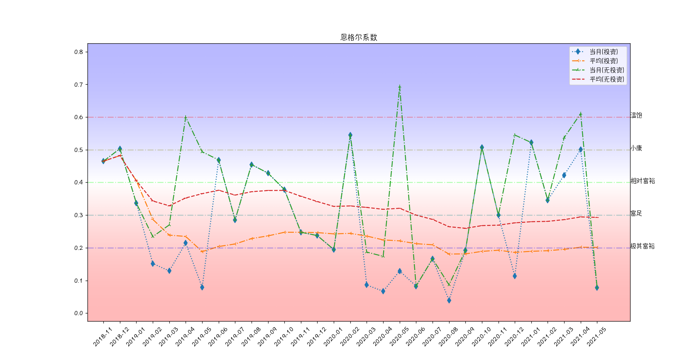

# README

[toc]


## 1. Introduction

随手记拓展应用(version 5.0)

`myMoney.xls`文件需从[随手记官网](sui.com)下载。

**Style 1**

> 选取一段时间内的各类数据，列出柱状图。

**Style 2**

> 按 每月/每天/每小时 统计各类数据情况。一天内的吃饭分布效果明显。

**Style 3**

> 画出一段时间内的消费变化曲线。

**Style 4**

> 选取两类数据做除法，绘制曲线。应用之一，恩格尔系数曲线。


## 2. Requirements

```
python		3.7.3
numpy		1.18.5
matplotlib	3.3.2
xlrd		1.2.0
xlwt		1.3.0
```


## 3. Code

### 3.1. `AccountingBook.py`

```python
class AccountingBook:
    def __init__(self, filename='myMoney.xls'):
        """Initialization

        Args:
            filename (str, default='myMoney.xls'): Excel table file.

        Attributes:
            deals (list): See structure below.
            tree (dict): See structure below.
            accounts (dict): See structure below.
            init_time (datetime.datetime)
            update_time (datetime.datetime)
        """
```

### 3.2. `Avalyse_v4.py`

```python
## Draw the following items:
## 
##      BAR + [categories]
## ^                |
## |        |       |
## |    |   |   |   |   |
## -------------------------->
##      A   B   C   D   E
##
##      BAR + hour/day/month + [categories]
## ^                         -A
## |                         -B
## |     |  |       ||
## |    ||  ||  ||  ||  ||
## -------------------------->
##      1   2   3   4   5
##
##      LINE + week/month/season/year + [categories]
## ^  _         ____________
## |_/ \      /              xN
## |    \____/
## -------------------------->
##  1 2 3 4 5 6 7 8 9 10 11 12

class Analyse:
    """Data Analysis"""
    def __init__(self, AB, *args, **kwarg):
        """
        Args:
            AB (AccountingBook): AccountingBook object.
            args (tuple):
                CALC_MODE_OFF
                    kind (str): `line` or `bar`.
                    category (list): List of categories.
                    interval (str *): One of [hour day week month season year]. * optional in some cases.
                CALC_MODE_ON
                    kind (str): `engle` or `custom`.
                    interval (str): week month season year
                    category (list *): [A, B], calculate A/B.
            kwarg (dict):
                start (datetime.datetime)
                end (datetime.datetime)

        Arguments:
            order (Organize)
            xaxis_obj (Xaxis)
            values_obj (Values)
        """
```

### 3.3. `COLOR.py`

```python
def hsv2rgb(h, s, v):
    """HSV color gumat to RGB

    Arguments:
        h (float): Hue, 0-360 degree.
        s (float): Saturation, 0-1.
        v (float): Intensity, 0-1.

    Returns:
        r (int): Red, 0-255.
        g (int): Green, 0-255.
        b (int): Blue, 0-255.
    """
```

### 3.4. `RUN.py`

```python
#!/usr/local/bin/python3
# -*- coding:utf-8 -*-
from datetime import datetime as dt

from Analyse_v4 import Analyse
from AccountingBook import AccountingBook as AB

if __name__ == '__main__':
    ab = AB()
    # ...
```

### 3.5. `Values.py`

```python
class Values:
    def __init__(self, AB, *args, **kwarg):
        """
        Args:
            AB (AccountingBook): AccountingBook object.
            args (tuple):
                CALC_MODE_OFF
                    kind (str): `line` or `bar`.
                    category (list): List of categories.
                    interval (str *): One of [hour day week month season year]. * optional in some cases.
                CALC_MODE_ON
                    kind (str): `engle` or `custom`.
                    interval (str): week month season year
                    category (list *): [A, B], calculate A/B.
            kwarg (dict):
                start (datetime.datetime)
                end (datetime.datetime)
        """
```

### 3.6. `WriteDown.py`

```python
class Organize:
    def __init__(self, accountingbook, *args):
        self.ab = accountingbook
        if len(args) > 0:
            self.s_time = max(self.ab.init_time, min(args))
            self.e_time = min(self.ab.update_time, max(args))
        else:
            self.s_time = self.ab.init_time
            self.e_time = self.ab.update_time

        self.wb = wt.Workbook(encoding='utf-8')
        self.sheets = {}
        for name in ['hour', 'day', 'week', 'month', 'season', 'year']:
            self.sheets[name] = self.wb.add_sheet(name, cell_overwrite_ok=True)

    def update(self):
        self.hour()
        self.day()
        self.week()
        self.month()
        self.season()
        self.year()

    def save(self, name='ready'):
        self.wb.save(name.split('.')[0]+'.xls')
```

### 3.7. `Xaxis.py`

```python
class Xaxis:
    def __init__(self, AB, *args, **kwarg):
        """
        Args:
            AB (AccountingBook): AccountingBook object.
            args (tuple):
                CALC_MODE_OFF
                    kind (str): `line` or `bar`.
                    category (list): List of categories.
                    interval (str *): One of [hour day week month season year]. * optional in some cases.
                CALC_MODE_ON
                    kind (str): `engle` or `custom`.
                    interval (str): week month season year
                    category (list *): [A, B], calculate A/B.
            kwarg (dict):
                start (datetime.datetime)
                end (datetime.datetime)
        """
```


## 4. Results



















